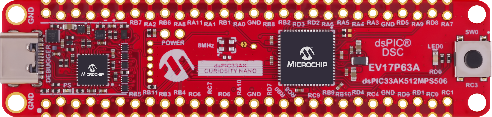

<picture>
    <source media="(prefers-color-scheme: dark)" srcset="images/microchip_logo_white_red.png">
	<source media="(prefers-color-scheme: light)" srcset="images/microchip_logo_black_red.png">
    
</picture>

## dsPIC33AK512MPS506 Curiosity Nano Out of Box Demo (EV17P63A)

## Summary

## Related Documentation
* [dsPIC33AK512MPS506 Project Page - https://www.microchip.com/en-us/product/dspic33ak512mps506](https://www.microchip.com/en-us/product/dspic33ak512mps506)
* [dsPIC33AK512MPS506 Curiosity Nano Demo Board Page - https://www.microchip.com/EV17P63A](https://www.microchip.com/EV17P63A)

## Software Used 
* [MPLAB X 6.25 or later - https://www.microchip.com/mplabx](https://www.microchip.com/mplabx)
* [XC-DSC 3.21 or later - https://www.microchip.com/xcdsc](https://www.microchip.com/xcdsc)
* dsPIC33AK-MP_DFP 1.2.135 or later
* Terminal Software

## Hardware Used
* [dsPIC33AK Curiosity Nano Demo Board Page - https://www.microchip.com/EV17P63A](https://www.microchip.com/EV17P63A)

## Setup
* Connect the USB-C port to a host computer
* Open a serial terminal program to 230400 8-N-1 to the port associated with the board
* Compile and program the demo into the board

## Operation
* On reset, the board will print out "dsPIC33AK512MPS506 Curiosity Nano Demo. Please press on-board button to initiate demo."
* Pressing the button will print "Button pressed! Enjoy the blink." and the LED will blink.
* Releasing the button will print "Button not pressed... please press to observe blink." and the LED will stop blinking.

